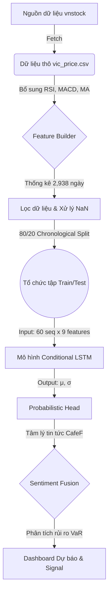

# 📑 CHƯƠNG 3: NGHIÊN CỨU VÀ XÂY DỰNG HỆ THỐNG

## 3.1. Nghiên cứu hệ thống

### 3.1.1. Đối tượng hướng đến và Mục đích hệ thống

#### 3.1.1.1. Đối tượng hướng đến
Hệ thống dự báo cổ phiếu VIC được thiết kế để phục vụ các nhóm đối tượng chính sau:
- **Nhà đầu tư cá nhân:** Những người cần một công cụ hỗ trợ ra quyết định khách quan, dựa trên dữ liệu thay vì cảm tính đám đông.
- **Nhà quản lý danh mục (Portfolio Manager):** Cần một hệ thống định lượng rủi ro (VaR) để tối ưu hóa tỷ trọng cổ phiếu VIC trong danh mục đầu tư.
- **Sinh viên & Nhà nghiên cứu Tài chính định lượng:** Sử dụng hệ thống như một mô hình mẫu về việc ứng dụng Deep Learning (LSTM) kết hợp với Bayesian/Probabilistic logic trong thị trường chứng khoán Việt Nam.

#### 3.1.1.2. Mục đích hệ thống
Hệ thống không chỉ dừng lại ở việc dự báo giá mà hướng tới ba mục tiêu chiến lược:
1. **Định lượng sự bất định (Uncertainty Quantification):** Cung cấp độ lệch chuẩn σ để nhà đầu tư biết được mức độ tin cậy của dự báo tại từng thời điểm.
2. **Giảm thiểu rủi ro (Risk Mitigation):** Thông qua chỉ số VaR và xác suất tăng giá (P-Gain), hệ thống ngăn chặn các quyết định mua bán sai lầm trong vùng thị trường biến động cực đoan.
3. **Hợp nhất đa luồng thông tin:** Kết hợp logic của Phân tích kỹ thuật (Technical Analysis) và Phân tích cảm xúc (Sentiment Analysis) từ tin tức để tạo ra một "bộ não" dự báo toàn diện.

### 3.1.2. Tập hợp dữ liệu

#### 3.1.2.1. Nguồn gốc dữ liệu
* **Nguồn chính thức:**
Dữ liệu về giá cổ phiếu VIC (Tập đoàn Vingroup) được thu thập từ thư viện `vnstock` phiên bản 3.x - một thư viện Python mã nguồn mở hàng đầu cho thị trường chứng khoán Việt Nam. Thư viện này cho phép truy xuất dữ liệu từ các nguồn uy tín như **VCI Securities** và **VNDirect**.

* **Đặc điểm của nguồn dữ liệu:**
- **Độ tin cậy cao:** Dữ liệu trực tiếp từ hệ thống giao dịch chính thức của sàn HOSE.
- **Cập nhật theo thời gian thực:** Đồng bộ ngay lập tức sau mỗi phiên giao dịch hàng ngày.
- **Tính minh bạch:** Bất kỳ ai cũng có thể kiểm chứng và tải dữ liệu thông qua API mở.

* **Thông tin về bộ dữ liệu:**
**Bảng 3.1. Bảng thông tin về bộ dữ liệu thực tế**

| Thuộc tính | Giá trị |
|------------|---------|
| **Mã cổ phiếu** | VIC (Tập đoàn Vingroup) |
| **Sàn giao dịch** | HOSE (Sở GDCK TP.HCM) |
| **Khoảng thời gian** | 27/06/2014 - 01/04/2026 (~12 năm) |
| **Tổng số ngày giao dịch** | 2,938 ngày (Dữ liệu thực tế tại máy) |
| **Tần suất** | Theo ngày (Daily) |
| **Trạng thái** | Công khai |
| **Định dạng** | CSV (UTF-8) |
| **Kích thước** | ~320 KB (Bao gồm đặc trưng mở rộng) |

#### 3.1.2.2. Mô tả chi tiết các đặc trưng
Hệ thống sử dụng **9 đặc trưng** (Feature) chuyên sâu để tối ưu hóa khả năng nhận diện xu hướng của Robot:

**Bảng 3.2. Mô tả chi tiết các đặc trưng mở rộng**

| STT | Tên đặc trưng | Ký hiệu | Mô tả | Vai trò |
|-----|---------------|---------|-------|---------|
| 1 | Giá đóng cửa | `close` | Giá chốt phiên giao dịch | Target & Seq |
| 2 | Giá mở cửa | `open` | Giá phiên sáng | Input |
| 3 | Giá cao nhất | `high` | Giá đỉnh trong phiên | Input |
| 4 | Giá thấp nhất | `low` | Giá đáy trong phiên | Input |
| 5 | Vol Chuẩn hóa | `volume_norm` | `Volume / MA(Volume, 20)` | Input |
| 6 | Chỉ số RSI | `rsi` | Relative Strength Index (14 ngày) | Input (Quá mua/bán) |
| 7 | Chỉ số MACD | `macd` | Moving Average Conv/Div | Input (Xu hướng) |
| 8 | Đường MA20 | `ma20` | Trung bình động 20 phiên | Input (Ngưỡng hỗ trợ) |
| 9 | Độ biến động | `volatility` | Độ lệch chuẩn 20 phiên | Đọc hiểu Rủi ro |

#### 3.1.2.2.1. Vai trò và Tác động của các chỉ số đến kết quả dự báo

Mỗi chỉ số đóng vai trò là một "giác quan" giúp Robot nhận diện thị trường từ nhiều góc độ khác nhau:

- **Chỉ số RSI (Sức mạnh tương đối):**
  - **Mục tiêu:** Xác định trạng thái quá mua (Overbought) hoặc quá bán (Oversold).
  - **Tác động:** Khi RSI > 70, Robot nhận diện rủi ro đảo chiều giảm giá; khi RSI < 30, Robot nhận diện cơ hội tạo đáy. Chỉ số này giúp Robot không mua đuổi ở vùng giá quá cao.
- **Chỉ số MACD (Hội tụ/Phân kỳ):**
  - **Mục tiêu:** Xác định xu hướng (Trend) và động lượng (Momentum) của giá.
  - **Tác động:** Giúp Robot phân biệt được đâu là một cú tăng giá thực sự (Strong Trend) và đâu chỉ là các biến động nhiễu ngắn hạn. MACD dương và đang tăng giúp giá trị kỳ vọng μ tăng cao.
- **Đường MA20 (Trung bình động 20 phiên):**
  - **Mục tiêu:** Xác định ngưỡng hỗ trợ và kháng cự tâm lý trong trung hạn.
  - **Tác động:** Giá nằm trên MA20 thường là dấu hiệu của một xu hướng tăng bền vững. Robot sử dụng MA20 làm "mốc neo" để đánh giá mức độ lệch của giá hiện tại so với giá trị trung bình tháng.
- **Độ biến động (Volatility):**
  - **Mục tiêu:** Định lượng mức độ rủi ro và "độ rung lắc" của cổ phiếu.
  - **Tác động:** Ảnh hưởng trực tiếp đến tham số **$\sigma$ (độ bất định)** của Robot. Volatility càng cao, Robot càng đưa ra sải dự báo rộng hơn để cảnh báo rà soát rủi ro.
- **Khối lượng chuẩn hóa (Volume_Norm):**
  - **Mục tiêu:** Xác nhận tính bùng nổ hoặc suy kiệt của dòng tiền.
  - **Tác động:** "Giá tăng cần có thanh khoản". Nếu giá tăng nhưng Volume thấp, Robot sẽ đánh giá đây là tín hiệu yếu; ngược lại, sự bù bùng nổ Volume giúp Robot tự tin hơn trong các quyết định BUY (Mua).

#### 3.1.2.3. Thống kê mô tả dữ liệu
**Bảng 3.3. Thống kê mô tả dữ liệu (2014 - 2026)**

| Chỉ số thống kê | Giá trị thực tế | Đơn vị / Ghi chú |
|-----------------|-----------------|------------------|
| **Số ngày giao dịch** | 2,938 | ngày |
| **Giá thấp nhất (Min)** | 8.91 | nghìn đồng |
| **Giá cao nhất (Max)** | 179.0 | nghìn đồng |
| **Giá trung bình (Mean)** | ~35.47 | nghìn đồng |
| **Độ biến động (Std)** | ~26.24 | nghìn đồng |
| **Biên độ dao động** | ~1,908% | (Max - Min) / Min × 100 |

#### 3.1.2.4. Định nghĩa Input và Output
Hệ thống sử dụng cơ chế **Conditional Forecasting** (Dự báo có điều kiện theo Horizon).

**Bảng 3.4. Định nghĩa Input và Output (Upgrade v2.0)**

| Mục tiêu | Nội dung |
|----------|----------|
| **Dự đoán ngày** | Ngày hiện tại + Horizon (X ngày) |
| **Input cần (Tầm nhìn)** | **60 ngày giao dịch liên tiếp** (trước ngày cần dự đoán) |
| **Đặc trưng đầu vào** | 60 ngày × 9 features = 540 giá trị |
| **Output đầu ra** | **Phân phối Gaussian (μ, σ)**: Kỳ vọng và Rủi ro |

#### 3.1.2.5. Tổng hợp số lượng mẫu
Mô hình "trượt" qua dữ liệu lịch sử để tạo ra tập mẫu huấn luyện khổng lồ:

**Bảng 3.5. Bảng tổng hợp số lượng mẫu huấn luyện**

| Tập dữ liệu | Số mẫu | Input Shape | Output Shape | Ghi chú |
|-------------|--------|-------------|--------------|---------|
| **Tổng số mẫu** | ~28,056 | (60, 9) | (2,) | Gồm μ và σ |
| **Tập Train (80%)** | ~22,445 | (60, 9) | (2,) | Dữ liệu quá khứ |
| **Tập Test (20%)** | ~5,611 | (60, 9) | (2,) | Dữ liệu đánh giá |

#### 3.1.2.6. Khả năng tái tạo
Dữ liệu được cập nhật tự động thông qua Python script tích hợp trong hệ thống:
```python
from vnstock import *
df = stock_historical_data("VIC", "2014-06-01", "2026-04-01", "stock")
```

### 3.1.3. Mục tiêu
Thông qua mô hình **Conditional LSTM**, hệ thống hướng tới việc cung cấp một "bản đồ xác suất" về giá VIC. Robot không chỉ đưa ra con số dự đoán chính xác nhất (μ) mà còn định lượng được mức độ rủi ro (σ). Điều này giúp các nhà đầu tư không chỉ biết "mua hay bán" mà còn biết "nên tin vào Robot bao nhiêu phần trăm" để giảm thiểu tối đa rủi ro trong môi trường chứng khoán biến động. 🕵️‍♂️🎯💎

### 3.1.4. Một số khó khăn gặp phải
- **Hiện tượng Overfitting:** Mô hình LSTM rất dễ "học vẹt" dữ liệu quá khứ. Hệ thống đã khắc phục bằng cách sử dụng Dropout (0.2) và Gaussian NLL Loss để mô hình học cách bao quát thay vì chỉ học từng điểm giá.
- **Dữ liệu nhiễu (Volatility):** Thị trường chứng khoán Việt Nam chịu ảnh hưởng mạnh bởi tin tức đột ngột. Việc chỉ dùng giá là không đủ, hệ thống đã mở rộng thêm các chỉ báo RSI/MACD để "lọc nhiễu".
- **Tài nguyên tính toán:** Với chuỗi 60 ngày và 28k mẫu, việc huấn luyện đòi hỏi CPU/GPU ổn định. Robot hiện đang huấn luyện 100 Epochs để đạt độ hội tụ tốt nhất.

### 3.1.5. Minh họa cơ chế tính toán (Gaussian LSTM)

#### 3.1.5.1. Chuẩn chuẩn bị dữ liệu (Seq Prep)
Giả sử dự báo cho ngày **01/04/2026**, Robot lấy 60 phiên trước đó và đưa qua bộ `FeatureScaler`.
- **Giá thực:** 170,000 VNĐ → **Chuẩn hóa (Z-score):** +0.8 (Do giá cao hơn trung bình lịch sử).

#### 3.1.5.2. Luồng xử lý qua LSTM Cells
Mỗi bước thời gian t (từ 1 đến 60) sẽ đi qua 2 lớp LSTM để cập nhật trạng thái ẩn (Hidden State):
1. **Cổng quên (Forget Gate):** Xóa thông tin cũ từ 2 tháng trước nếu xu hướng giá đã thay đổi.
2. **Cổng đầu vào (Input Gate):** Khóa lại các phiên có Volume đột biến để nhấn mạnh vào chu kỳ hiện tại.
3. **Hidden State (h60):** Tổng hợp toàn bộ "ký ức" từ 60 ngày qua thành một Tensor vector 128 chiều.

#### 3.1.5.3. Đầu ra xác suất (Probabilistic Head)
Vector 128 chiều được đưa qua lớp Linear cuối cùng để tính toán:
- **μ (Lợi nhuận kỳ vọng):** AI tính toán dựa trên xu hướng RSI và MACD hiện tại là +4.2%.
- **σ (Độ bất định):** Dựa trên độ dao động (Volatility) 20 phiên gần nhất, AI ước tính độ rung lắc là ±1.5%.

#### 3.1.5.4. Chuyển đổi về Signal hành động
**Kết quả dự báo:**
- **P(Gain > 0):** ~85% (Xác suất tăng giá rất cao).
- **VaR 95%:** -1.2% (Khoản lỗ xấu nhất có thể xảy ra trong 95% trường hợp).
- **Action:** **BUY** (Mua vào).

### 3.1.6. Các mô hình nghiên cứu và Lý do lựa chọn

Hệ thống triển khai 3 cấp độ mô hình để đảm bảo tính khách quan và so sánh hiệu năng thực tế:

#### 3.1.6.1. Hồi quy tuyến tính (Linear Regression)
- **Định nghĩa:** Là phương pháp phân tích thống kê dùng để dự đoán giá trị của một biến phụ thuộc dựa trên giá trị của các biến độc lập thông qua một hàm tuyến tính toán học đơn giản.
- **Lý do sử dụng:** Đóng vai trò là **Mô hình cơ sở (Baseline)**. Việc sử dụng LR giúp chứng minh rằng dữ liệu cổ phiếu thực sự có tính phức tạp mà các hàm tuyến tính đơn giản không thể biểu diễn hết được, từ đó làm nổi bật giá trị của các mô hình Deep Learning.

#### 3.1.6.2. Rừng ngẫu nhiên (Random Forest)
- **Định nghĩa:** Là thuật toán học máy thuộc nhóm Ensemble Learning, xây dựng một "rừng" gồm nhiều cây quyết định (Decision Trees) và tổng hợp kết quả của chúng để đạt được độ chính xác và độ ổn định cao hơn.
- **Lý do sử dụng:** Giúp hệ thống nhận diện được các **mối quan hệ phi tuyến tính** và tương tác giữa các chỉ báo (ví dụ: sự kết hợp giữa RSI quá mua và Volume giảm). RF có khả năng chịu đựng nhiễu và ngăn chặn Overfitting tốt hơn các cây quyết định đơn lẻ.

#### 3.1.6.3. Mạng LSTM có điều kiện (Conditional LSTM)
- **Định nghĩa:** Là một dạng cải tiến của mạng nơ-ron tái phát (RNN), thiết kế đặc biệt để học và ghi nhớ các mối phụ thuộc dài hạn trong dữ liệu chuỗi. Phiên bản "Conditional" cho phép nạp thêm các tham số điều kiện (như Horizon) để tùy biến đầu ra.
- **Lý do sử dụng:** Đây là **công nghệ cốt lõi** vì thị trường chứng khoán bản chất là dữ liệu chuỗi thời gian. LSTM là mô hình duy nhất có khả năng "ghi nhớ" các sự kiện từ 60 phiên trước để đưa ra dự báo cho hiện tại. Đồng thời, đây là mô hình duy nhất hỗ trợ Gaussian Head để tính toán xác suất và rủi ro.

#### 3.1.6.4. Mô hình Ngôn ngữ lớn (NLP/LLM) - PhoBERT
- **Định nghĩa:** Là mô hình ngôn ngữ dựa trên kiến trúc Transformer (BERT) được tiền huấn luyện trên 20GB dữ liệu văn bản tiếng Việt. Đây là mô hình chuẩn quốc tế cho các tác vụ xử lý ngôn ngữ tự nhiên tại Việt Nam.
- **Lý do sử dụng:** Tin tức tài chính trên CafeF thường mang tính ẩn dụ hoặc thuật ngữ chuyên sâu (ví dụ: "giảm không đáng kể" khác với "giảm sâu"). **PhoBERT** giúp hệ thống hiểu được **ngữ cảnh (Context)** và **sắc thái (Sentiment)** phức tạp mà các bộ lọc từ khóa thông thường không thể nhận diện được. Kết quả từ PhoBERT cung cấp điểm số `sentiment` (-1 đến 1) cực kỳ chính xác để đưa vào công thức Sentiment Fusion.

---

## 3.2. Xây dựng mô hình

### 3.2.1. Sơ đồ luồng dữ liệu và giải quyết bài toán



**Hình 3.1. Sơ đồ luồng dữ liệu và giải quyết bài toán nâng cấp v2.0**

### 3.2.2. Tổng hợp các công thức tính toán theo quy trình

Hệ thống vận hành thông qua chuỗi 5 giai đoạn toán học khép kín:

#### Giai đoạn 1: Xử lý đặc trưng (Feature Engineering)
Dữ liệu thô được chuyển đổi qua các công thức chỉ báo kỹ thuật:
- **RSI (Relative Strength Index):** `100 - (100 / (1 + AvgGain/AvgLoss))`. 
  - `AvgGain`: Trung bình các phiên tăng trong chu kỳ 14 ngày.
  - `AvgLoss`: Trung bình các phiên giảm trong chu kỳ 14 ngày.
  - *Ý nghĩa:* Tỷ lệ sức mạnh tương đối giữa các phiên tăng và giảm.
- **MACD (Moving Average Convergence Divergence):** `EMA(12) - EMA(26)`.
  - `EMA(n)`: Trung bình trượt lũy thừa chu kỳ n phiên.
  - *Ý nghĩa:* Hiệu số giữa hai đường trung bình động để tìm điểm giao cắt xu hướng.
- **Số nhân Volume:** `Volume_Norm = Volume / MA(Volume, 20)`.
  - `MA(Volume, 20)`: Trung bình khối lượng giao dịch của 20 phiên gần nhất.
  - *Ý nghĩa:* Tỷ lệ thanh khoản hiện tại so với mức trung bình của 1 tháng.

#### Giai đoạn 2: Chuẩn hóa dữ liệu (Normalization)
- **Z-Score Scaling:** `z = (x - μ) / σ`.
  - `x`: Giá trị gốc của đặc trưng (ví dụ: Giá Close).
  - `μ` (Mean): Giá trị trung bình của đặc trưng đó trong tập huấn luyện.
  - `σ` (Standard Deviation): Độ lệch chuẩn của đặc trưng đó.
  - `z`: Giá trị sau chuẩn hóa (thường nằm trong khoảng [-3, 3]).

#### Giai đoạn 3: Tính toán chuỗi qua các cổng LSTM
Mô hình xử lý 60 bước thời gian qua các cổng điều hướng thông tin:
- **Cổng quên (Forget Gate):** `ft = σ(Wf·xt + Uf·ht-1 + bf)`.
  - `ft`: Kết quả lọc (0: xóa sạch, 1: giữ lại toàn bộ).
  - `W, U`: Các ma trận trọng số (Weights) AI học được.
  - `ht-1`: Thông tin của ngày trước đó (Hidden State).
  - `xt`: Đặc trưng của ngày hiện tại (Input).
  - `bf`: Độ chệch (Bias).
  - `σ` (Sigmoid): Hàm kích hoạt nén giá trị về khoảng [0, 1].
- **Cổng cập nhật (Memory update):** `Ct = ft * Ct-1 + it * tanh(...)`.
  - `Ct`: Trạng thái ô nhớ (Ký ức dài hạn).
  - `tanh`: Hàm kích hoạt nén giá trị về khoảng [-1, 1].
  - `it` (Input Gate): Kiểm soát bao nhiêu thông tin mới được nạp vào ký ức.

#### Giai đoạn 4: Dự báo xác suất (Probabilistic Forecasting)
- **Gaussian Negative Log-Likelihood (Loss Function):** `L = 0.5 * [log(σ²) + (y - μ)² / σ²]`.
  - `μ` (Mu): Lợi nhuận kỳ vọng do AI dự báo (trung tâm quả chuông Gaussian).
  - `σ` (Sigma): Độ bất định/rủi ro do AI dự báo (độ rộng quả chuông).
  - `y`: Lợi nhuận thực tế diễn ra trong tương lai (Ground Truth).
  - `log(σ²)`: Phần phạt nếu AI dự đoán quá thiếu tự tin (σ quá lớn).
  - `(y - μ)² / σ²`: Phần phạt nếu giá thực tế nằm xa dự báo kỳ vọng.

#### Giai đoạn 4: Hợp nhất cảm xúc (Sentiment Fusion)
- **Công thức điều chỉnh kỳ vọng:** `μ_adj = μ + α * sentiment * impact`.
  - `α` (Alpha): Trọng số điều chỉnh lợi nhuận (mặc định 0.3).
  - `sentiment`: Điểm cảm xúc từ tin tức (Tiêu cực -1 đến Tích cực 1).
  - `impact`: Mức độ ảnh hưởng của tin tức đó (0 đến 1).
  - `μ_adj`: Lợi nhuận kỳ vọng sau khi đã "nghe ngóng" tin tức thị trường.
- **Công thức điều chỉnh rủi ro:** `σ_adj = σ * (1 + β * |sentiment| * impact)`.
  - `β` (Beta): Trọng số điều chỉnh rủi ro (mặc định 0.5).
  - `|sentiment|`: Giá trị tuyệt đối của cảm xúc (tin cực xấu hay cực tốt đều làm tăng rủi ro).
  - `σ_adj`: Độ rộng rủi ro mới sau khi có tin tức tác động.

#### Giai đoạn 5: Ra quyết định (Risk Assessment)
- **Xác suất tăng giá (Probability Gain):** `P_Gain = 1 - Φ((0 - μ_adj) / σ_adj)`.
  - `Φ` (Phi): Hàm phân phối tích lũy (Cumulative Distribution Function) của phân phối chuẩn.
  - `(0 - μ_adj) / σ_adj`: Khoảng cách từ điểm hòa vốn (0) đến trung tâm dự báo, tính theo đơn vị σ.
  - `P_Gain`: Tỷ lệ phần trăm khả năng lợi nhuận > 0.
- **Value-at-Risk (VaR 95%):** `VaR = μ_adj - 1.65 * σ_adj`.
  - `1.65`: Hệ số tin cậy tương ứng với xác suất 95% trong phân phối chuẩn.
  - `VaR`: Khoản lỗ tối đa ước tính (ví dụ: VaR = -2% nghĩa là trong 95% trường hợp bạn sẽ không lỗ quá 2%).
- **Ngưỡng Cắt lỗ (Stop Loss):** `SL = Price * (1 - max(1.5 * σ_adj, 0.03))`.
  - `1.5 * σ_adj`: Khoảng bảo hiểm dựa trên độ rung lắc thực tế của thị trường.
  - `0.03`: Ngưỡng cắt lỗ tối thiểu 3% để tránh các biến động nhỏ (nhiễu).
- **Ngưỡng Chốt lời (Take Profit):** `TP = Price * (1 + max(μ_adj, 0.05))`.
  - `μ_adj`: Lợi nhuận kỳ vọng của AI.
  - `0.05`: Ngưỡng chốt lời tối thiểu 5% để đảm bảo hiệu quả đầu tư.
