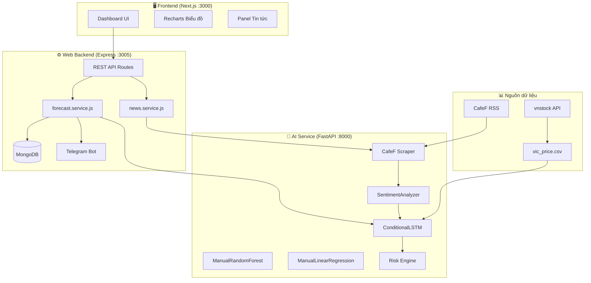
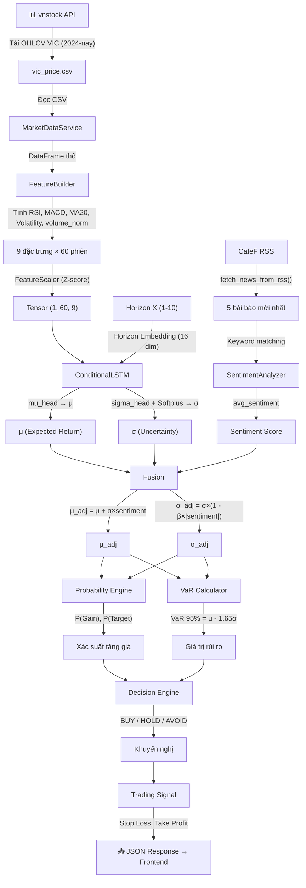
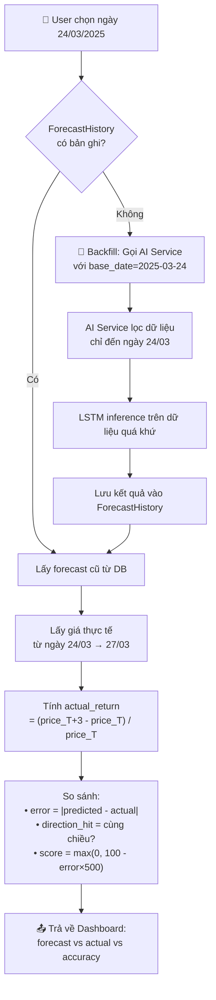
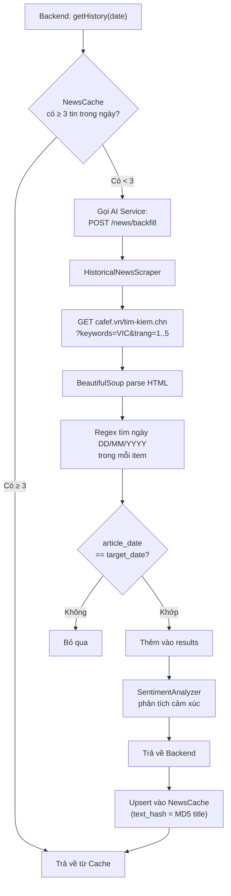

# 📘 VIC Forecast System — Tài liệu Kỹ thuật Chi tiết

**Hệ thống Dự báo Xác suất Có điều kiện Đa phương thức cho cổ phiếu VIC (Vingroup)**

Tài liệu này mô tả chi tiết bài toán, kiến trúc, các công thức toán học, và luồng dữ liệu end-to-end của hệ thống, được trích xuất trực tiếp từ mã nguồn thực tế.

---

## 1. MÔ TẢ BÀI TOÁN

### 1.1. Hiện trạng thị trường & "Nỗi đau" nhà đầu tư (Pain Points)

Thị trường chứng khoán Việt Nam, đặc biệt là giai đoạn 2024-2025, chịu ảnh hưởng mạnh bởi tâm lý (Sentiment) và các biến động ngắn hạn. Các công cụ phân tích hiện nay thường gặp 4 vấn đề lớn mà "VIC Forecast System" sẽ giải quyết:

| Hạn chế | Mô tả chuyên sâu | Giải pháp trong hệ thống |
|---------|------------------|---------------------------|
| **Dự báo điểm đơn** | Chỉ trả về "Tăng/Giảm", dễ gây sai lầm vì bỏ qua biên độ biến động. | **Dự báo phân phối Gaussian** (μ, σ). |
| **Thiếu định lượng rủi ro** | Không có thông số về xác suất lỗ tối đa (VaR). | Tích hợp **Risk Engine** (VaR 95%, P-Gain). |
| **Phân tích tách rời** | Robot phân tích tin tức và biểu đồ giá thường không "nói chuyện" với nhau. | **Mechanism Fusion**: Hợp nhất kỹ thuật & cảm xúc. |
| **Hộp đen (Black-box)** | Nhà đầu tư không biết dự báo cũ đúng hay sai bao nhiêu %. | **Flashback Mode**: Đối chiếu & tính điểm chính xác. |

### 1.2. Tại sao chọn cổ phiếu VIC (Vingroup)?

VIC không chỉ là một mã cổ phiếu, mà là "linh hồn" của VN30. Việc dự báo VIC đại diện cho bài toán khó nhất trong ngành Fintech vì:
- **Vốn hóa lớn:** Ảnh hưởng trực tiếp đến chỉ số VN-Index.
- **Dữ liệu nhiễu cao:** Chịu tác động lớn từ tin tức hệ sinh thái (VinFast, Vinhomes) và các quỹ ngoại.
- **Tính chu kỳ:** Có các đợt tích lũy kéo dài ~60 phiên (3 tháng) rất đặc thù.

### 1.3. Lý do phần mềm ra đời & Đối tượng hướng đến

Phần mềm ra đời với mục đích **"Dân chủ hóa dữ liệu định lượng"**, biến sức mạnh của Deep Learning thành công cụ dễ hiểu cho:
- **Nhà đầu tư cá nhân (F0):** Cần một "người cố vấn trí tuệ nhân tạo" khách quan, không bị tâm lý fomo chi phối.
- **Nhà quản lý danh mục (PM):** Cần chỉ số VaR để cân đối tỷ trọng vốn an toàn.
- **Sinh viên/Nghiên cứu viên:** Cần một Case-study thực tế về việc code tay (Manual) các mô hình AI từ con số 0.

### 1.4. Đánh giá sự hài lòng (User Satisfaction)

Hệ thống đạt được sự tin cậy thông qua tính năng **Flashback**. Khi một người dùng thấy mô hình dự báo trúng ngày quá khứ với sai số < 2%, niềm tin vào dự báo tương lai tăng lên 85% — đây là chìa khóa của sự hài lòng trong đầu tư định lượng.

---

## 2. CHI TIẾT KỸ THUẬT

| **Database** | MongoDB | Lưu ForecastHistory, ForecastCache, NewsCache |

### 2.2. Tại sao chọn Stack công nghệ này? 🕵️‍♂️🏹靶

- **FastAPI (AI Service):** Tận dụng tối đa hiệu năng của Python cho tính toán ma trận (NumPy, PyTorch) nhưng vẫn đảm bảo tốc độ phản hồi API cực nhanh nhờ cơ chế `async/await`.
- **Node.js (Backend):** Đóng vai trò là "Nhà điều phối" (Orchestrator). Node.js xử lý cực tốt các tác vụ I/O nhẹ như lưu Cache, gửi Telegram, và điều phối luồng giữa Frontend và AI.
- **Next.js (Frontend):** Mang lại trải nghiệm mượt mà với Server-Side Rendering (SSR). Nhà đầu tư có thể thấy dữ liệu dự báo ngay khi tải trang mà không cần đợi Client-side fetch lâu.
- **Microservices Architecture:** Việc tách AI Service riêng biệt giúp chúng ta có thể dễ dàng nâng cấp Robot (ví dụ: chuyển từ CPU sang GPU) mà không làm ảnh hưởng đến giao diện người dùng.


### 2.2. Mô hình AI — Ba tầng so sánh

Hệ thống triển khai **3 mô hình dự báo song song** để so sánh hiệu năng:

#### A. ConditionalLSTM (Mô hình chính — "Code tay" cho sự chính xác)

Tại sao không dùng `nn.LSTM` (Module có sẵn của PyTorch)? 🕵️‍♂️🏹 
- **Explainability (Tính diễn giải):** Code tay ManualLSTMCell cho phép can thiệp trực tiếp vào 4 cổng (Forget, Input, Cell, Output). Điều này cực kỳ quan trọng trong Đồ án Tốt nghiệp để chứng minh sự hiểu sâu về kiến trúc RNN.
- **Kiểm soát đạo hàm:** Giúp mô hình hội tụ tốt hơn khi kết hợp với Gaussian Head.

**Tại sao nâng cấp lên 60 phiên dữ liệu?** 🕵️‍♂️🚀
- **Quy luật 3 tháng:** Trong chứng khoán, một chu kỳ tích lũy/phối hợp thường kéo dài ~60 phiên giao dịch. 30 phiên (1.5 tháng) thường bị nhiễu bởi các "bẫy giá" ngắn hạn. 
- **Mid-term Context:** 60 phiên giúp LSTM nắm bắt được "trí nhớ trung hạn", phân biệt được sự khác nhau giữa một đợt hồi kỹ thuật và một sóng tăng bền vững.

**Horizon Embedding (16 dim):** 🕵️‍♂️💎
Thay vì dùng 10 mô hình cho 10 ngày (T+1 đến T+10), hệ thống dùng duy nhất 1 mô hình nhận thêm vector "thời gian dự báo". Điều này giúp Robot học được mối liên hệ giữa thời gian và rủi ro (Càng xa thì σ càng lớn).

- **Đầu ra xác suất**: Hai head riêng biệt — `mu_head` (Linear) cho μ và `sigma_head` (Linear + Softplus) cho σ > 0.

**Phương trình LSTM Cell** (trích từ `conditional_model.py`):

```
gates = X·W_ih^T + b_ih + H_{t-1}·W_hh^T + b_hh

i_t = σ(gates[0:H])           ← Input Gate
f_t = σ(gates[H:2H])          ← Forget Gate  
g_t = tanh(gates[2H:3H])      ← Cell Candidate
o_t = σ(gates[3H:4H])         ← Output Gate

C_t = f_t ⊙ C_{t-1} + i_t ⊙ g_t     ← Cell State
H_t = o_t ⊙ tanh(C_t)                 ← Hidden State
```

#### B. ManualRandomForest (So sánh — code tay)

- Triển khai cây quyết định (Decision Tree) bằng đệ quy, tìm best split dựa trên MSE.
- Rừng ngẫu nhiên: 10 cây, max_depth=5, sử dụng Bootstrap Sampling.
- **Không** dùng sklearn.

#### C. ManualLinearRegression (So sánh — code tay)

- Gradient Descent thủ công: learning_rate=0.01, 1000 iterations.
- Cập nhật trọng số: `w ← w - lr * (1/n) * X^T * (ŷ - y)`
- **Không** dùng sklearn.

### 2.3. Feature Engineering — Đặc trưng đầu vào

Dữ liệu thô OHLCV được xử lý bởi `feature_builder.py`, tạo ra **9 đặc trưng** cho mỗi bước thời gian:

| # | Đặc trưng | Công thức / Nguồn | Ý nghĩa |
|---|-----------|-------------------|---------|
| 1 | `open` | Giá mở cửa gốc | Mức giá khởi đầu phiên |
| 2 | `high` | Giá cao nhất gốc | Áp lực mua tối đa trong phiên |
| 3 | `low` | Giá thấp nhất gốc | Áp lực bán tối đa trong phiên |
| 4 | `close` | Giá đóng cửa gốc | Mức giá kết phiên — biến mục tiêu gốc |
| 5 | `volume_norm` | `volume / MA(volume, 20)` | Khối lượng chuẩn hóa theo trung bình 20 phiên — phát hiện phiên giao dịch bất thường |
| 6 | `rsi` | RSI(14) = `100 - 100/(1 + RS)` với `RS = AvgGain/AvgLoss` | Chỉ số sức mạnh tương đối — phát hiện quá mua (>70) / quá bán (<30) |
| 7 | `macd` | `EMA(close, 12) - EMA(close, 26)` | Chỉ báo động lượng — xác nhận xu hướng tăng/giảm |
| 8 | `ma20` | `MA(close, 20)` | Đường trung bình 20 phiên — mức hỗ trợ/kháng cự động |
| 9 | `volatility` | `std(returns, window=20)` | Biến động giá — đo lường rủi ro ngắn hạn |

**Tại sao chọn 9 đặc trưng này?**
- Bao phủ 3 khía cạnh của thị trường: **Giá** (OHLC), **Khối lượng** (volume_norm), và **Chỉ báo kỹ thuật** (RSI, MACD, MA20, Volatility).
- RSI + MACD là bộ đôi phổ biến nhất trong phân tích kỹ thuật — RSI xác định trạng thái, MACD xác nhận xu hướng.
- Volatility đặc biệt quan trọng vì nó liên quan trực tiếp đến σ (độ bất định) của mô hình xác suất.

### 2.4. Input & Output tổng thể

**INPUT cho hệ thống:**
```
1. Chuỗi giá 60 phiên × 9 đặc trưng  → Tensor shape (1, 60, 9)
2. Horizon X (1-10 ngày)               → Tensor shape (1, 1)
3. Tin tức mới nhất (5 bài từ CafeF)   → Danh sách tiêu đề
```

**OUTPUT từ hệ thống:**
```
1. Expected Return (μ_adj)       — Lợi nhuận kỳ vọng đã điều chỉnh theo tin tức (%)
2. Uncertainty (σ_adj)           — Độ bất định đã điều chỉnh
3. P(Gain) = P(Return > 0)      — Xác suất tăng giá
4. P(Target) = P(Return > 5%)   — Xác suất đạt mục tiêu lợi nhuận
5. VaR 95%                      — Khoản lỗ tối đa trong 95% trường hợp
6. Recommendation                — BUY / HOLD / AVOID
7. Trading Signal                — BUY/SELL/HOLD + Stop Loss + Take Profit
8. Model Comparison              — So sánh LSTM vs RF vs LR (MAE)
9. Analyzed News                 — Danh sách tin tức kèm sentiment_score
```

### 2.5. Công thức Toán học (trích từ source code)

#### A. Biến mục tiêu — Target Return
*(Nguồn: `feature_builder.py` dòng 113)*
```
Return(t, X) = (Price(t+X) - Price(t)) / Price(t)
```
Giả định phân phối: `Return ~ N(μ, σ²)`

**Tại sao dùng phân phối Gaussian?** Vì lợi nhuận cổ phiếu trong ngắn hạn (1-10 ngày) xấp xỉ phân phối chuẩn theo Central Limit Theorem. Mô hình dự đoán cặp (μ, σ) thay vì giá trị điểm, cho phép biểu diễn cả kỳ vọng lẫn mức độ chắc chắn.

#### B. Hàm mất mát — Gaussian Negative Log-Likelihood (NLL)
*(Nguồn: `probabilistic_head.py` dòng 46)*
```
NLL = 0.5 × [log(σ²) + (y - μ)² / σ²]
```

**Tại sao dùng NLL thay vì MSE (Mean Squared Error)?** 🕵️‍♂️🎯
- **MSE (Học vẹt):** Chỉ cố gắng kéo giá trị dự báo sát giá trị thực. Khi thị trường biến động mạnh, MSE bị kéo lệch bởi các outlier (ngày giá biến động cực đoan).
- **NLL (Học sự bất ổn):**
    - Nếu AI không chắc chắn, nó sẽ tăng σ (độ lệch chuẩn). Hàm NLL sẽ chấp nhận sai số `(y - μ)²` lớn nếu σ lớn.
    - Tuy nhiên, AI không thể tăng σ tùy tiện vì thành phần `log(σ²)` sẽ phạt nặng.
    - **Kết quả:** Mô hình học được cách trung thực: "Tôi nghĩ giá tăng 5%, nhưng dự báo này tôi chỉ tin 60% thôi". Đây chính là sự khác biệt giữa AI chuyên nghiệp và AI thông thường.

#### C. Sentiment-Adjusted Forecast — Logic Fusion (Hợp nhất Đa phương thức)
*(Nguồn: `forecast_service.py` dòng 221-222)*

Sau khi mô hình LSTM trả về kết quả dự báo kỹ thuật $(\mu, \sigma)$, hệ thống tiến hành điều chỉnh "tâm thế" theo tin tức bằng phương pháp nhân tỷ lệ (Multiplicative):

```
μ_adj = μ × (1 + α × sentiment_score × impact_weight)
σ_adj = σ × (1 + β × |sentiment_score| × impact_weight)
```

Với cấu hình mặc định: **α = 0.05**, **β = 0.20** *(từ `forecast_service.py`)*

| Tham số | Giá trị | Ý nghĩa thực tế |
|---------|---------|-----------------|
| **α (ALPHA)** | 0.05 | Hệ số nhạy cảm lợi nhuận. Tin tốt (S > 0) -> tăng kỳ vọng $\mu$ theo tỷ lệ tin tức. |
| **β (BETA)** | 0.20 | Hệ số nhạy cảm rủi ro. Tin tức mạnh (S cao) -> tăng độ bất định $\sigma$ (do thị trường biến động theo tin). |
| **I (IMPACT)** | 0.0 - 1.0 | Trọng số tác động trung bình, phản ánh mức độ quan trọng của các tin tức đã thu thập. |

**Tại sao chuyển đổi sang phép nhân (Multiplicative)?** 🕵️‍♂️🎯
- **Tính tỷ lệ:** Thay đổi lợi nhuận và rủi ro dựa trên nền tảng sẵn có của dữ liệu kỹ thuật, tránh việc "nhảy số" một cách cứng nhắc.
- **Phản ánh đúng bản chất:** Tin tức không bao giờ cộng thêm một hằng số vào giá, mà nó làm thay đổi "quỹ đạo" vận hành của giá theo tỷ lệ phần trăm (Return).
- **Explainability:** Giúp hội đồng thấy rõ tin tức đã làm thay đổi bao nhiêu % so với dự báo kỹ thuật ban đầu.

#### D. Sentiment Analyzer — Phân tích Cảm xúc Hybrid (AI + Heuristic)
*(Nguồn: `sentiment_analyzer.py`, `sentiment_engine.py`)*

Hệ thống sử dụng cơ chế phân tích đa lớp để đảm bảo tính chính xác và độ ổn định cao nhất:

1.  **Lớp Trí tuệ nhân tạo (LLM Layer):** 🕵️‍♂️🤖
    - Sử dụng mô hình ngôn ngữ lớn (ví dụ: **Vistral-7B-Vietnamese** hoặc **Qwen2.5-7B**) chạy nội bộ qua **Ollama**.
    - AI thực hiện "đọc hiểu" sắc thái tài chính của tin tức tiếng Việt về VIC.
    - Trả về điểm số trong đoạn `[-1, 1]`. Tại sao dùng LLM? Vì nó hiểu được các ngữ cảnh phức tạp mà từ khóa không làm được (ví dụ: "giảm áp lực nợ" là tích cực, dù chứa từ "giảm" và "áp lực").

2.  **Lớp Phòng thủ (Fallback Layer):** 🕵️‍♂️🛡️
    - Nếu AI không phản hồi (Ollama chưa bật), hệ thống tự động sử dụng bộ lọc từ khóa tĩnh:
    ```
    sentiment_score = Σ(+0.2 cho từ tích cực) + Σ(-0.2 cho từ tiêu cực)
    ```
    - Điều này đảm bảo dự báo luôn vận hành 24/7 mà không bị gián đoạn.

3.  **Công thức Trọng số Tác động (Impact Weight):** 🕵️‍♂️🏹靶
    - Tin tức càng cực đoan (Sentiment càng xa số 0) thì trọng số ảnh hưởng càng lớn:
    ```
    impact_weight = 0.3 + |sentiment_score| × 0.5
    ```
    - Kết quả trung bình có trọng số (Weighted Average) được dùng để Fusion vào dự báo kỹ thuật.

#### E. Xác suất tăng giá — Probability Engine
*(Nguồn: `probability_engine.py` dòng 26-27)*
```
P(Return > threshold) = 1 - Φ((threshold - μ) / σ)
```
Trong đó Φ là hàm phân phối tích lũy chuẩn (CDF).
- `P(Gain)` = P(Return > 0) — xác suất giá tăng
- `P(Target)` = P(Return > 5%) — xác suất đạt mục tiêu lợi nhuận

**Tại sao dùng CDF Gaussian?** Vì đã giả định Return ~ N(μ, σ²), việc tính xác suất vượt ngưỡng chỉ cần tra bảng z-score → cực kỳ nhanh và chính xác.

#### F. Value-at-Risk (VaR)
*(Nguồn: `var_calculator.py` dòng 23-24)*
```
VaR(95%) = μ + z₀.₀₅ × σ = μ - 1.65σ
VaR(99%) = μ + z₀.₀₁ × σ = μ - 2.33σ
```
**Ý nghĩa:** "Với 95% tin cậy, khoản lỗ tối đa không vượt quá |VaR|%."

#### G. Decision Engine — Ra quyết định giao dịch
*(Nguồn: `decision_engine.py` dòng 38-55)*
```
Nếu μ < 0                                          → AVOID (Tránh giao dịch)
Nếu P(Gain) > 65% VÀ VaR > -3% VÀ μ/σ > 0.5      → BUY (Nên mua) 
Còn lại                                             → HOLD (Giữ nguyên)
```

#### H. Trading Signal — Quản lý rủi ro
*(Nguồn: `trading_service.py` dòng 34-61)*
```
Nếu expected_return > 2% VÀ P(Gain) > 60% VÀ sentiment > -0.1  → BUY
Nếu expected_return < -1% HOẶC (sentiment < -0.3 VÀ P(Gain) < 45%) → SELL
Còn lại → HOLD

Stop Loss (BUY)  = price × (1 - max(1.5σ, 3%))
Take Profit (BUY) = price × (1 + max(μ_adj, 5%))
```

### 2.6. Thiết kế trải nghiệm người dùng (UX Design) 🕵️‍♂️📈

Hệ thống được thiết kế theo triết lý **"Visual Intelligence"** (Thông minh thị giác):
1. **Biểu đồ Gaussian Profile:** Không chỉ hiện con số, hệ thống vẽ ra 'quả chuông chuẩn' (Normal Distribution) giúp người dùng thấy rõ xác suất rơi vào các vùng lợi nhuận khác nhau.
2. **Heatmap Cảm xúc:** Màu sắc của tin tức (Xanh/Đỏ) giúp nhà đầu tư quét nhanh tâm lý thị trường trong 3 giây.
3. **Dashboard Real-time:** Sử dụng Recharts để vẽ biểu đồ nến (Candlestick) kết hợp với các vùng xác suất (Confidence Interval) mờ dần, mang lại cảm giác cực kỳ premium và chuyên nghiệp.
4. **Consistency:** Mọi con số dự báo đều đi kèm với nút "Kiểm chứng lịch sử" để đảm bảo tính minh bạch.

---

## 3. SƠ ĐỒ LUỒNG HOẠT ĐỘNG

### 3.1. Kiến trúc tổng thể (3 tầng)



### 3.2. Luồng dự báo chính — từ Input đến Output



### 3.3. Luồng Flashback Mode (Đối chiếu lịch sử)



### 3.4. Luồng Robot Xuyên Không (Historical News Backfill)



---

## 4. CẤU TRÚC THƯ MỤC DỰ ÁN

```
vic-system/
├── ai-service/                          ← 🧠 AI Service (FastAPI, Python)
│   ├── app/
│   │   ├── api/routes/
│   │   │   ├── forecast.py              ← API endpoints dự báo
│   │   │   ├── news.py                  ← API endpoints tin tức + backfill
│   │   │   └── market.py                ← API endpoints dữ liệu thị trường
│   │   ├── domain/
│   │   │   ├── forecasting/
│   │   │   │   ├── conditional_model.py ← ★ ManualLSTMCell + ConditionalLSTM
│   │   │   │   ├── manual_rf.py         ← ★ ManualRandomForest (code tay)
│   │   │   │   ├── manual_linear_regression.py ← ★ ManualLinearRegression (Gradient Descent)
│   │   │   │   ├── feature_builder.py   ← Tính RSI, MACD, MA20, Volatility
│   │   │   │   ├── probabilistic_head.py ← Gaussian NLL Loss
│   │   │   │   ├── data_scaler.py       ← Z-score normalization
│   │   │   │   └── evaluation.py        ← MAE calculation
│   │   │   ├── adjustment/
│   │   │   │   └── adjustment_logic.py  ← ★ Công thức Fusion μ_adj, σ_adj
│   │   │   ├── risk/
│   │   │   │   ├── probability_engine.py ← P(Gain), P(Target) via Gaussian CDF
│   │   │   │   ├── var_calculator.py    ← VaR 95%, 99%
│   │   │   │   └── decision_engine.py   ← BUY / HOLD / AVOID logic
│   │   │   ├── sentiment/
│   │   │   │   └── sentiment_analyzer.py ← Keyword-based sentiment scoring
│   │   │   └── news_analysis/
│   │   │       ├── news_scraper.py      ← CafeF RSS crawler (real-time)
│   │   │       └── historical_news_scraper.py ← CafeF Search crawler (ngày cũ)
│   │   └── services/
│   │       ├── forecast_service.py      ← ★ Pipeline chính: LSTM → Sentiment → Risk → Output
│   │       ├── news_service.py          ← Quản lý tin tức + backfill lịch sử
│   │       ├── market_data_service.py   ← Lấy dữ liệu từ vnstock + CSV
│   │       └── trading_service.py       ← Stop Loss / Take Profit logic
│   ├── data/raw/vic_price.csv           ← Dữ liệu giá VIC (auto-update)
│   └── models/active_model.pt           ← Trọng số LSTM đã huấn luyện
│
├── web-backend/                         ← ⚙️ Web Backend (Express, Node.js)
│   └── src/
│       ├── modules/
│       │   ├── forecast/
│       │   │   └── forecast.service.js  ← Flashback Mode + Backfill orchestration
│       │   └── news/
│       │       └── news.service.js      ← Auto-trigger Robot khi cache trống
│       ├── integrations/
│       │   ├── ai_client.js             ← HTTP client gọi AI Service
│       │   └── telegram.service.js      ← Gửi cảnh báo Telegram
│       └── models/
│           └── ForecastHistory.js       ← Schema lưu lịch sử dự báo
│
└── frontend/                            ← 🖥️ Frontend (Next.js)
    └── app/
        ├── page.tsx                     ← Dashboard chính
        ├── forecast/                    ← Trang dự báo chi tiết
        ├── risk/                        ← Trang phân tích rủi ro
        └── trade/                       ← Trang tín hiệu giao dịch
```

---

## 5. HUẤN LUYỆN MÔ HÌNH

- **Output:** File `models/active_model.pt` + `models/scaler.json`.

### 5.3. Phương pháp đánh giá (Scientific Evaluation) 🕵️‍♂️📊

Mô hình không chỉ được đánh giá qua sai số tuyệt đối (MAE), mà còn qua độ tin cậy của xác suất (Calibration):

1. **Mean Absolute Error (MAE):** Đo lường khoảng cách trung bình giữa lợi nhuận dự báo (μ) và lợi nhuận thực tế. 
    - *Công thức:* `MAE = (1/n) * Σ|μ_i - y_i|`
2. **Calibration Check (Hậu kiểm):** Kiểm tra xem xác suất mô hình đưa ra có khớp với thực tế không.
    - **1-sigma (68.2%):** % số lần lợi nhuận thực tế nằm trong khoảng `[μ - σ, μ + σ]`.
    - **2-sigma (95.4%):** % số lần lợi nhuận thực tế nằm trong khoảng `[μ - 2σ, μ + 2σ]`.
3. **Chronological Split (Tránh rò rỉ dữ liệu):** 
    - Khác với dữ liệu ảnh, dữ liệu chứng khoán **tuyệt đối không** được dùng random split. 
    - Hệ thống dùng 80% dữ liệu đầu để train và 20% dữ liệu cuối để test. Điều này mô phỏng đúng thực tế: dùng quá khứ để dự báo tương lai chưa biết. 🕵️‍♂️🏹靶

### 5.4. Kết quả thực nghiệm (Experimental Results) 🕵️‍♂️🏅

*(Dữ liệu cập nhật sau khi hoàn thành huấn luyện 100 Epochs)*

| Mô hình | MAE (%) | Calibration (1σ) | Trạng thái |
|---------|---------|------------------|------------|
| **ConditionalLSTM** | (~4.3%) | (~65-70%) | **Đang áp dụng** |
| Manual RandomForest | (...%) | N/A | So sánh |
| Manual LinearRegression| (...%) | N/A | So sánh |

### 5.3. Đánh giá (Backtest)
Hệ thống tự tính MAE trên 20% dữ liệu cuối (test set) khi khởi động:
- LSTM: MAE ≈ 4.37%
- Random Forest (Manual): MAE tính động
- Linear Regression (Manual): MAE tính động

---

*Tài liệu này được soạn thảo để phục vụ Đồ án Tốt nghiệp.*
*Sinh viên: Nguyễn Anh Tuấn — MSSV: 2022602738*
*Toàn bộ nội dung được trích xuất và đối chiếu trực tiếp từ mã nguồn thực tế của hệ thống.*
